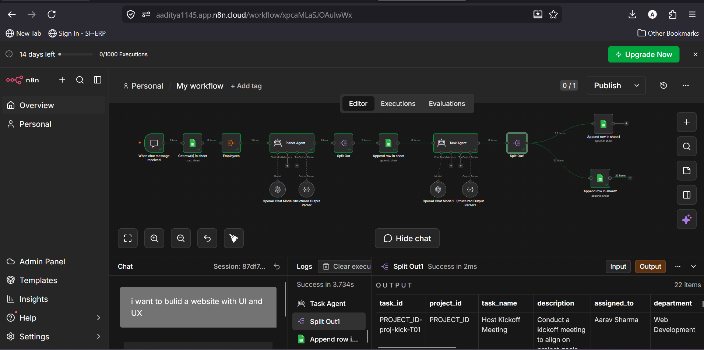
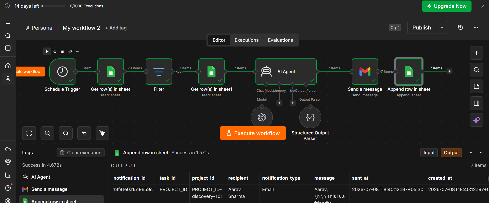
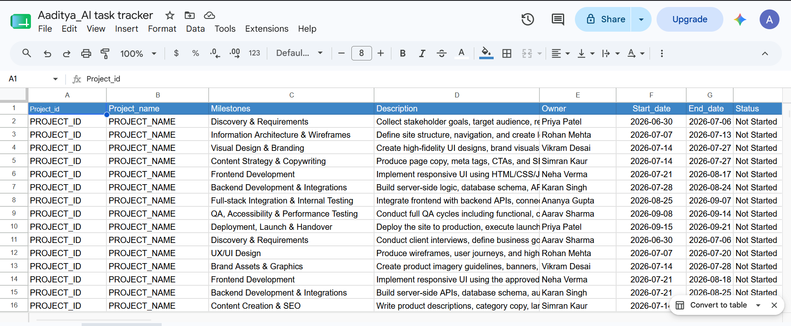

# 🤖 AI-Powered Project Planning & Task Reminder System

> An AI-powered workflow automation system that transforms project requirements into structured project plans, assigns tasks to team members, tracks deadlines, and sends automated reminder emails.

## 📌 Overview

This project was developed as part of the **Lenovo LEAP NextGen Scholar Internship 2026**.

The system leverages **OpenAI**, **n8n**, **Google Sheets**, and **Gmail** to automate project planning and task management.

It consists of two intelligent AI agents:

- **Planner AI Agent**
- **Task Reminder AI Agent**

---

# 🚀 Features

## 🧠 Planner AI Agent

The Planner Agent accepts a project requirement from the user and automatically:

- Generates project milestones
- Creates detailed tasks
- Assigns work to team members
- Defines project timelines
- Generates task descriptions
- Stores all information in Google Sheets

---

## 📧 Reminder AI Agent

The Reminder Agent continuously monitors project progress and:

- Tracks pending tasks
- Checks task deadlines
- Identifies overdue work
- Sends automated reminder emails
- Logs all notifications

---

# ⚙️ Workflow

```
User Requirement
        │
        ▼
Planner AI Agent (OpenAI)
        │
        ▼
Generate Milestones
        │
        ▼
Generate Tasks
        │
        ▼
Assign Team Members
        │
        ▼
Store in Google Sheets
        │
        ▼
Schedule Trigger
        │
        ▼
Reminder AI Agent
        │
        ▼
Check Deadlines
        │
        ▼
Send Reminder Emails
```

---

# 🛠️ Tech Stack

- n8n
- OpenAI API
- Google Sheets API
- Gmail API
- AI Agents
- Prompt Engineering
- Workflow Automation

---

# 📂 Project Structure

```
AI-Project-Planning-Agent/
│
├── AI_Project_Planning_Agent.json
├── AI_Task_Reminder_Agent.json
├── README.md
│
└── Screenshots/
    ├── workflow.png
    ├── google_sheet_data.png
    └── reminder_workflow.png

---

## 📸 Screenshots

### 🏗️ AI Project Planning Workflow

This workflow automatically generates project plans, assigns tasks using AI, and stores the results in Google Sheets.


---

### 🔔 AI Task Reminder Workflow

This workflow monitors project tasks and automatically sends personalized reminder emails to team members using AI and Gmail.


---
### 📊 Google Sheets Dataset

The workflow reads project details from Google Sheets and updates task information automatically.


---

# 📋 How It Works

### Step 1

User enters the project requirement.

Example:

```
I want to build an E-commerce Website.
```

---

### Step 2

Planner AI

- Understands the requirement
- Creates milestones
- Generates tasks
- Assigns team members
- Estimates timelines

---

### Step 3

Data is stored inside Google Sheets.

---

### Step 4

Reminder Agent runs automatically based on schedule.

It

- Reads project data
- Detects upcoming deadlines
- Sends reminder emails

---

# 💡 Use Cases

- Software Project Management
- Agile Sprint Planning
- Team Collaboration
- Automated Task Assignment
- Deadline Monitoring
- Workflow Automation

---

# 🔒 Security

This repository does **NOT** contain:

- OpenAI API Keys
- Google Credentials
- Gmail Credentials
- OAuth Tokens

Sensitive credentials have been removed.

---

# 📈 Future Improvements

- Slack Notifications
- Microsoft Teams Integration
- WhatsApp Notifications
- Dashboard Analytics
- Task Completion Prediction
- AI Risk Detection
- Calendar Integration

---

# 👨‍💻 Author

**Aaditya Rajendra Dhangar**

B.Tech - Artificial Intelligence & Data Science

Lenovo LEAP NextGen Scholar 2026

---

# ⭐ Acknowledgement

This project was developed during the **Lenovo LEAP NextGen Scholar Internship 2026**, a CSR initiative by **Lenovo**, implemented by **BharatCares** in collaboration with **AICTE**.

---

## 📜 License

This project is intended for educational and portfolio purposes.
